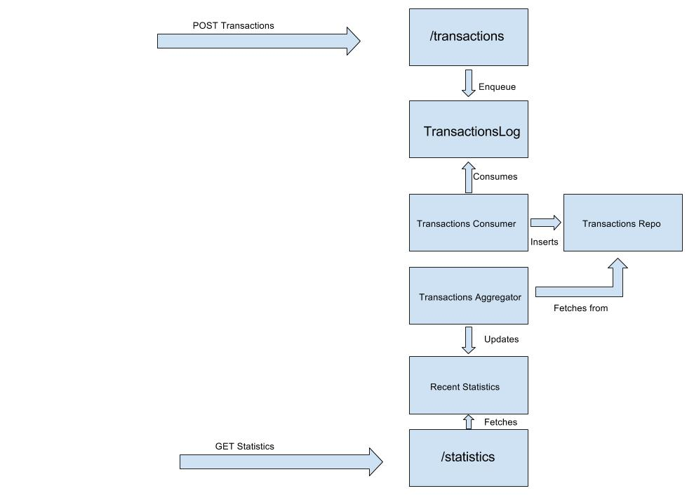

The Banking Application
=======================

This application is responsible for receiving transaction informations, aggregating them and providing recent statistics. It provides two endpoints:

  * `/transactions` - This endpoint accepts `POST` requests, with transaction informations. The request body is a JSON containing the following information:
    ```
      {
        "amount: "12",
        "timestamp": 1508835326999
      }
    ```
    Where:

      * `amount` - Is a `Double`, specifying the transaction amount
      * `timestamp` - Is a `Long`, specifying the transaction time in epoch in millis in UTC time zone (this is not current
timestamp)

    It returns:

      * 201 - in case of success
      * 204 - if transaction is older than 60 seconds

  * `/statistics` - This endpoint accepts `GET` requests. It returns a JSON object containing the statistics of the past sixty seconds, as follows:

    ```
      {
        "sum": 1000,
        "avg": 100,
        "max": 200,
        "min": 50,
        "count": 10
      }
    ```

    Where:

    * `sum` - is a double specifying the total sum of transaction value in the last 60 seconds
    * `avg` - is a double specifying the average amount of transaction value in the last 60 seconds
    * `max` - is a double specifying single highest transaction value in the last 60 seconds
    * `min` - is a double specifying single lowest transaction value in the last 60 seconds
    * `count` - is a long specifying the total number of transactions happened in the last 60 seconds

## Development

In order to run the application in the development mode, execute the following script:

  `$ scripts/start-server`

## Test

In order to run the unit tests, execute the following script:

  `$ scripts/test`

## About the code structure and overall design

The code was organized in a DDD-inspired manner, using business names for the packages and classes, instead of technical names. It is split into three flows, as explained here:

### The /transactions flow

  - This is the first entry point for the entire application. It receives transactions, that are therefore handled at `TransactionsController` and put them into a queue.

### The Aggregation flow

  - The background task `TransactionsConsumer`, is responsible for consuming the transactions from the queue and adding them into the Transactions repository
  - The Transaction repository has an in-memory structure, to store the transactions in a `Map<Timestamp, Transaction>` manner. It provides APIs for accessing these transactions, therefore the "database" is not visible outside this component
  - The background task `StatisticsAggregator`, is responsible for fetching the transactions from the past 60 seconds and then aggregating them. This aggregation is stored in the `RecentStatistic` component
  - There is still another background task, that is responsible for cleaning transactions that are older than 61 seconds, so we don't run out of memory so fast

###  The /statistics flow
  - This endpoint's responsibility is to fetch the `RecentStatistics` data and serving them as JSON to the user. The operation is O(1).

### The Flow diagram


